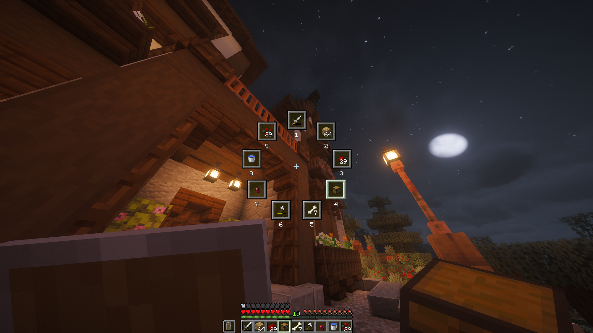

<p align="center">
  
</p>

<br>

<p align="center">
  <a href="https://modrinth.com/mod/slice">
    
  </a>
</p>
<p align="center">
  <a href="https://modrinth.com/mod/slice/versions?l=neoforge"></a>
  <a href="https://modrinth.com/mod/slice/versions?l=forge"></a>
  <a href="https://modrinth.com/mod/slice/versions?l=fabric"></a>
  <a href="https://modrinth.com/mod/slice/versions?l=quilt"></a>
</p>

## Features
- Flexible layout control with adjustable radius, item size, and rotation angles
- Visibility options for slots, numbers, and sprites
- Multiple interaction modes (toggle menu or click-to-select item)
- Configurable inner and outer deadzones
- Hotbar scrolling toggle
- Custom texture pack support

## Screenshots


[Click to watch the trailer/demo](https://www.youtube.com/watch?v=kq3pwFCv4ZM)

## Supported Versions
> **FYI**: <br> ✅ - Supported, ❌ - Unsupported, 🔍 - Planned / In development
<br> Minimum loader versions are in the same order as loaders in `Loaders` column <br> `Latest Slice version` doesn't cite the latest ***published*** version. Check the [Modrinth page](https://modrinth.com/mod/slice) for the latest available version.<br> Main development currently resides on version **`1.21.9`**. Why? idk

<table>
    <th>Version</th>
    <th></th>
    <th>Loaders</th>
    <th>Minimum required version</th>
    <th>Latest Slice version</th>
    <tr><td>1.21.11</td>  <td>✅</td>
        <td>
           
           
          
          
        </td>
        <td><code>21.11.0</code>, <code>61.0.0</code>, <code>0.18.0</code>, <code>0.30.0-beta</code></td>
        <td><code>0.2.1</code></td>
    </tr>
    <tr><td>1.21.10</td>  <td>✅</td>
        <td>
           
           
          
          
        </td>
        <td><code>21.10.0</code>, <code>60.0.0</code>, <code>0.18.0</code>, <code>0.30.0-beta</code></td>
        <td><code>1.0.0</code></td>
    </tr>
    <tr><td>1.21.9</td> <td>✅</td>
      <td>
         
         
        
        
      </td>
      <td><code>21.9.0</code>, <code>59.0.0</code>, <code>0.17.0</code>, <code>0.30.0-beta</code></td>
      <td><code>1.0.0</code></td>
    </tr>
    <tr><td>1.21.8</td> <td>❌</td><td></td><td></td><td></td></tr>
    <tr><td>1.21.7</td> <td>❌</td><td></td><td></td><td></td></tr>
    <tr><td>1.21.6</td> <td>❌</td><td></td><td></td><td></td></tr>
    <tr><td>1.21.5</td> <td>❌</td><td></td><td></td><td></td></tr>
    <tr><td>1.21.4</td> <td>❌</td><td></td><td></td><td></td></tr>
    <tr><td>1.21.3</td> <td>❌</td><td></td><td></td><td></td></tr>
    <tr><td>1.21.2</td> <td>❌</td><td></td><td></td><td></td></tr>
    <tr><td>1.21.1</td> <td>🔍</td><td></td><td></td><td></td></tr>
    <tr><td>1.21</td>   <td>❌</td><td></td><td></td><td></td></tr>
    <tr><td>1.20.2</td> <td>❌</td><td></td><td></td><td></td></tr>
    <tr><td>1.20.1</td> <td>❌</td><td></td><td></td><td></td></tr>
    <tr><td>1.20</td>   <td>❌</td><td></td><td></td><td></td></tr>
    <tr><td>1.19.4</td> <td>❌</td><td></td><td></td><td></td></tr>
    <tr><td>1.19.3</td> <td>❌</td><td></td><td></td><td></td></tr>
    <tr><td>1.19.2</td> <td>❌</td><td></td><td></td><td></td></tr>
    <tr><td>1.19.1</td> <td>❌</td><td></td><td></td><td></td></tr>
    <tr><td>1.19</td>   <td>❌</td><td></td><td></td><td></td></tr>
    <tr><td>1.18.2</td> <td>❌</td><td></td><td></td><td></td></tr>
    <tr><td>1.18.1</td> <td>❌</td><td></td><td></td><td></td></tr>
    <tr><td>1.18</td>   <td>❌</td><td></td><td></td><td></td></tr>
    <tr><td>1.17.1</td> <td>❌</td><td></td><td></td><td></td></tr>
    <tr><td>1.17</td>   <td>❌</td><td></td><td></td><td></td></tr>
    <tr><td>1.16.5</td> <td>❌</td><td></td><td></td><td></td></tr>
    <tr><td>1.16.4</td> <td>❌</td><td></td><td></td><td></td></tr>
    <tr><td>1.16.3</td> <td>❌</td><td></td><td></td><td></td></tr>
    <tr><td>1.16.2</td> <td>❌</td><td></td><td></td><td></td></tr>
    <tr><td>1.16.1</td> <td>❌</td><td></td><td></td><td></td></tr>
    <tr><td>1.16</td>   <td>❌</td><td></td><td></td><td></td></tr>
    <tr><td>1.15.2</td> <td>❌</td><td></td><td></td><td></td></tr>
    <tr><td>1.15.1</td> <td>❌</td><td></td><td></td><td></td></tr>
    <tr><td>1.15</td>   <td>❌</td><td></td><td></td><td></td></tr>
    <tr><td>1.14.4</td> <td>❌</td><td></td><td></td><td></td></tr>
    <tr><td>1.14.3</td> <td>❌</td><td></td><td></td><td></td></tr>
    <tr><td>1.14.2</td> <td>❌</td><td></td><td></td><td></td></tr>
    <tr><td>1.14.1</td> <td>❌</td><td></td><td></td><td></td></tr>
    <tr><td>1.14</td>   <td>❌</td><td></td><td></td><td></td></tr>
    <tr><td>1.13.2</td> <td>❌</td><td></td><td></td><td></td></tr>
    <tr><td>1.13.1</td> <td>❌</td><td></td><td></td><td></td></tr>
    <tr><td>1.13</td>   <td>❌</td><td></td><td></td><td></td></tr>
    <tr><td>1.12.2</td> <td>❌</td><td></td><td></td><td></td></tr>
    <tr><td>1.12</td>   <td>❌</td><td></td><td></td><td></td></tr>
    <tr><td>1.11.2</td> <td>❌</td><td></td><td></td><td></td></tr>
    <tr><td>1.11</td>   <td>❌</td><td></td><td></td><td></td></tr>
    <tr><td>1.10.2</td> <td>❌</td><td></td><td></td><td></td></tr>
    <tr><td>1.10</td>   <td>❌</td><td></td><td></td><td></td></tr>
    <tr><td>1.9.4</td>  <td>❌</td><td></td><td></td><td></td></tr>
    <tr><td>1.9</td>    <td>❌</td><td></td><td></td><td></td></tr>
    <tr><td>1.8.9</td>    
        <td>✅</td>
        <td> </td>
        <td><code>11.15.1.2318</code></td>
        <td><code>0.2.0</code></td>
    </tr>
    <tr><td>1.8</td>  <td>❌</td><td></td><td></td><td></td></tr>
    <tr><td>1.7.10</td> <td>❌</td><td></td><td></td><td></td></tr>
  </table>

### Dependencies

<details>
  <summary>
    
    <h4>NeoForge</h4>
  </summary>
   None
</details>

<details>
  <summary>
    
    <h4>Forge</h4>
  </summary>
   None
</details>

<details>
  <summary>
    
    <h4>Fabric</h4>
  </summary>

  <table>
    <th>Minecraft version</th>
    <th>Minimum FabricAPI version</th>
    <tr><td>1.21.11</td><td><code>0.139.4+1.21.11</code></td></tr>
    <tr><td>1.21.10</td><td><code>0.134.1+1.21.10</code></td></tr>
    <tr><td>1.21.9</td><td><code>0.133.14+1.21.9</code></td></tr>
  </table>
  
</details>

<details>
  <summary>
    
    <h4>Quilt</h4>
  </summary>

  <table>
    <th>Minecraft version</th>
    <th>Minimum FabricAPI version</th>
    <tr><td>1.21.11</td><td><code>0.139.4+1.21.11</code></td></tr>
    <tr><td>1.21.10</td><td><code>0.134.1+1.21.10</code></td></tr>
    <tr><td>1.21.9</td><td><code>0.133.14+1.21.9</code></td></tr>
  </table>
  
</details>

## How to customize/configure

###  Neoforge
NeoForge offers an in-game config menu.
```
Main Menu > Mods > *Select Slice* > Config
```

###  Forge
I cannot be bothered to implement a config screen for Forge. Please just edit the config file yourself.

####  Modrinth

```
Profile > (⋮) button > Open folder > (Explorer) config > (Explorer) slice-common.toml
```

####  Stock launcher
```
(File Explorer) %appdata% > .minecraft > config > slice-common.toml
```

Save the file and use `/slice reloadClient` to reload the config file.

###  Fabric
Download [Mod Menu](https://modrinth.com/mod/modmenu) and use their config menu instead.
```
Main Menu > Mods > *Select Slice* > -Config button next to the name-
```
###  Quilt
Download [Mod Menu](https://modrinth.com/mod/modmenu) and use their config menu instead.
```
Main Menu > Mods > *Select Slice* > -Config button next to the name-
```

## Feedback

Feel free to send feedback on the [issues page](https://github.com/Tomkov1c/Slice/issues). Feature requests and bug reports are always welcome! Stars too :)

<details>
  <summary>
    <h2>Credits</h2>
  </summary>
  <ul>
    <li><a href="https://badges.penpow.dev/badges/">Fancy badges</a> (Readme badges)</li>
    <li><a href="https://intergrav.github.io/devins-badges-docs/">Devin's badges</a> (Readme badges)</li>
    <li><a href="https://github.com/jaredlll08/MultiLoader-Template">jaredlll08 (Multiloader template)</li>
    <li><a href="https://github.com/JannisX11/blockbench">JannisX11 (Blockbench)</li>
    <li><a href="https://github.com/ewanhowell5195/MinecraftTitleGenerator">Ewan Howell (Minecraft title generator)</li>
    <li><a href="https://www.aseprite.org/">Aseprite</li></a>
  </ul>
</details>


<hr>

<a href="https://ko-fi.com/tomkliner">
  
</a>
